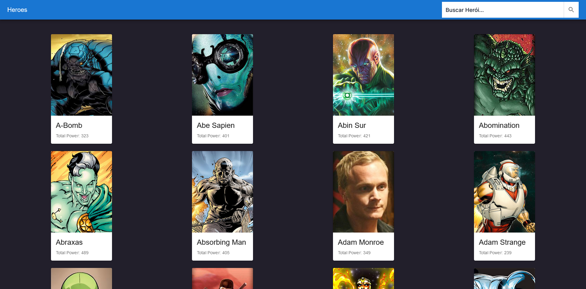

# Desafio Jornada do Herói (Azapfy)

O projeto consiste na manipulação da Api: http://homologacao3.azapfy.com.br/api/ps/metahumans, disponibilizado pela azapfy, que retorna dados de vários personagens. O projeto contém cards desses personagens, um input de filtragem dos personagens e também ao clicar em dois heróis um modal é exibido informando o ganhador. Vence aquele com maior somatório de powerstats.

## Índice

- [Visão geral](#visão-geral)
  - [Screenshot Desktop](#screenshot-desktop)
  - [Como executar](#como-executar)
  - [O Projeto](#o-projeto)
  - [Links](#links)
- [Construído com](#construído-com)
- [Autor](#autor)

## Visão geral

### Screenshot Desktop



**Modal**


### Como executar

#### Requisitos
* Node
* VS code
* Git

**Clone o projeto em alguma pasta pelo CMD**

```bash
git clone https://github.com/Vinicius-gif/jornada-do-heroi.git 
```
Em seguida acesse a pasta do projeto
```bash
cd jornada-do-heroi
```
Depois instale as dependências do projeto
```bash
npm i
```
**E por ultimo, execulte o projeto com**

```bash
npm run dev
```
**Acesse o endereço: http://localhost:3000/**


### O Projeto

Os usuários devem ser capazes de:

-  Visualizar o layout ideal para o site, dependendo do tamanho da tela do seu dispositivo
-  Visualizar a listagem dos cards na tela (imagem, nome e poder)
-  Utilizar a barra de pesquisa para encontrar o personagem
-  Clicar em dois personagens para visualizar o modal de batalha
- Visualizar o modal exibindo o vencedor

## Construído com

- [Next.js](https://nextjs.org/) - React framework
- [Tailwind css](https://tailwindcss.com/) - Para estilização
- Material UI
- React Icons
- React Context - gerenciar estados
- Fech - Para consumir API
- React hooks
- Responsividade
- Eslint - identação do código

## Autor

- Linkedin - [Vinicius Felipe](https://www.linkedin.com/in/vinicius-felipe-5148a81b5/)
